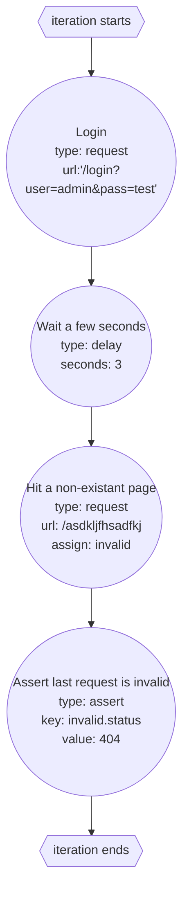

import { Code } from '@astrojs/starlight/components';

An individual action is basically a step that runs once per iteration. This can include making a [request](/floodr/benchmark-reference/request), [introducing a delay between actions](/floodr/benchmark-reference/delay), etc. For example with the following file:

<Code title="benchmark.yaml" lang="yaml" code={`
base: 'http://localhost:4896'

plan:
  - name: Login
    request:
      url: /login?user=admin&pass=test
  - name: Wait a few seconds
    delay:
      seconds: 3
  - name: Hit a non-existant page
    request:
      url: /asdkljfhsadfkj
    assign: invalid
  - name: Assert last request is invalid
    assert:
      key: invalid.status
      value: 404
`}/>

Creats 4 actions, and causes 2 HTTP requests. These actions make up a single iteration, meaning each iteration would look like this:

TODO: CREATE DIAGRAM
