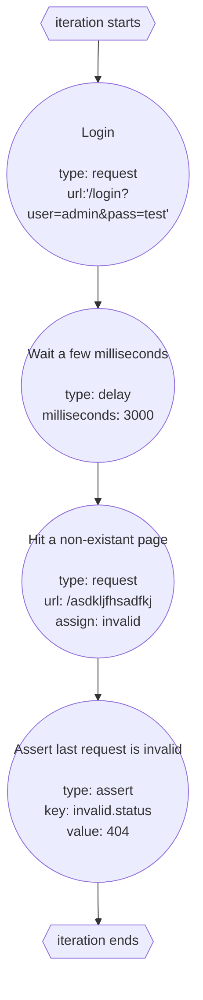

import { Code, Aside } from '@astrojs/starlight/components';

An individual action is basically a step that runs once per iteration. This can include making a [request](/floodr/benchmark-reference/request), [introducing a delay](/floodr/benchmark-reference/delay), etc. For example with the following file:

<Code title="benchmark.yml" lang="yaml" code={`
base: 'http://localhost:4896'

plan:
  - name: Login
    request:
      url: /login?user=admin&pass=test
  - name: Wait a few milliseconds
    delay:
      milliseconds: 3000
  - name: Hit a non-existant page
    request:
      url: /asdkljfhsadfkj
    assign: invalid
  - name: Assert last request is invalid
    assert:
      key: invalid.status
      value: 404
`}/>

Creates 4 actions, and causes 2 HTTP requests. These actions make up a single iteration, meaning each iteration would look like this:

<Aside type={"danger"}>
It's important to note that actions run **sequentially**, meaning the order you define them in is relevent to their execution. This means [assignments](/floodr/benchmark-reference/actions/assign) **must** happen before the variables are used.
</Aside>
