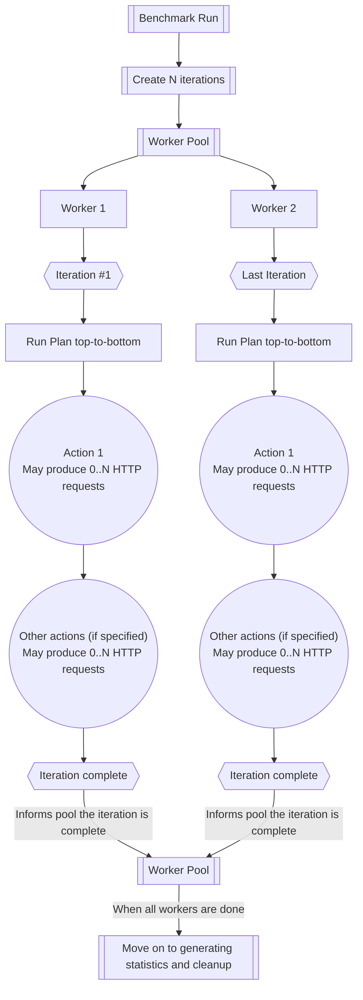
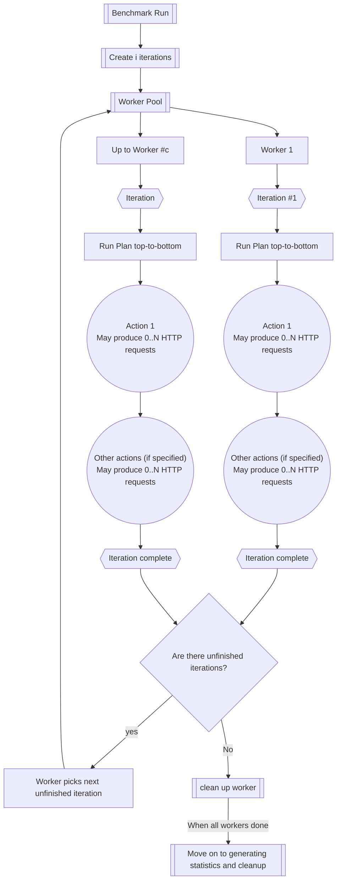

import { Aside } from '@astrojs/starlight/components';
import { Code } from '@astrojs/starlight/components';

This section will outline the options available when creating your benchmark file.

<Aside type={"caution"}>
If you haven't yet read it <a href="/floodr/getting-started/basic-usage">check out the basic usage guide</a> before continuing
</Aside>

## Terms & Format

When using the reference documentation here are some terms that are useful to know about. The benchmark file itself is a [YAML](https://docs.ansible.com/projects/ansible/latest/reference_appendices/YAMLSyntax.html) file that contains the following:

| Term | Description | Required |
|------|-------------|----------|
| **Plan** | The plan is the part of the benchmark that contains all the actions. Runs top-down, so **action order matters** | Yes |
| **Action** | An individual step taken by an individual iteration  | At least 1 |
| **Expandable** | An attribute applied to an action that causes it to expand to multiple requests | Optional per [request](/floodr/benchmark-reference/actions/requests) action | 
| **Config** | All the data not associated with the plan in the benchmark (base, concurrency, iteration, rampup, ect.) | Yes |
| **Base** |  The domain to run the benchmark against (e.g `http://localhost:4896`) | yes | 
| **Concurrency** |  Number of threads to run. Each thread runs an iteration, then moves on to the next iteration. **Be careful** when setting this high, you can freeze up or slow down your system. | optional (default 1)| 
| **Iterations** |  The number of iterations to run. Essentially the number of times that the plan will be re-run | optional (default 1) | 
| **Rampup** |  How much extra waiting time to add between each iteration so they don't all start at once. When defined it increases the delay to start an iteration by `rampup`/`iterations`, so a rampup of 50 with 5 iterations would give you 5 seconds between each iteration | optional (default 0) | 

So the file format looks comething like this:

<Code title="schema.yaml" lang="yaml" code={`
# Config
base: http://example.domain
concurrency: 1
iterations: 1
rampup: 0

plan: # Plan
  - name: Action name
    action_type:
      action_fields
    expandables:
      expandable_fields`}/>

<Aside type="note">The above file will not actually work, it's just an example of the schema, a real example is below</Aside>

Here is an example file

<Code title="benchmark.yaml" lang="yaml" code={`
# Config section
base: 'http://localhost:4896' # The domain we want to hit
concurrency: 2 # Number of threads to run
iterations: 10 # Number of times to run the actions defined in plan

# The plan, will run the number of times defined by iterations
plan: # An array of actions to take
  - name: Fetch route
    request:
      url: /
    assign: gothamServer`}/>

<Aside type="note">

If you want to follow along, below is the code for the server

<details>
    <summary>Click for code</summary>

`cargo.toml`

```toml
[package]
name = "gotham_hello"
version = "0.1.0"
edition = "2021"

[dependencies]
gotham = "0.7"
mime = "0.3"
```

`src/main.rs`

```rust
use gotham::helpers::http::response::create_response;
use gotham::hyper::{Body, Response, StatusCode};
use gotham::state::State;
use gotham::router::builder::*;
use gotham::router::Router;
use mime;

fn hello(state: State) -> (State, Response<Body>) {
    let mut response = create_response(
        &state,
        StatusCode::OK,
        mime::TEXT_PLAIN,
        "Hello World!",
    );

    response
        .headers_mut()
        .insert("x-backend", "gotham".parse().unwrap());

    (state, response)
}

fn router() -> Router {
    build_simple_router(|route| {
        route.get("/").to(hello);
    })
}

fn main() {
    println!("Listening on http://0.0.0.0:4896");
    gotham::start("0.0.0.0:4896", router());
}
```

</details>

</Aside>

To run our file we would then run:

```bash
floodr benchmark.yaml
```

## FAQ

<details>
  <summary>How does concurrency effect iterations?</summary>

It doesn't, but it does effect runtime. In general you can imagine the run process as a pool of workers that is `concurency` sized. The pool will pop scheduled `iteration`s until there's none left, re-using the threads as it goes. Below illustrates `concurrency == 2` and `iterations == 2`:



In general if there are $$i$$ iterations and concurency == $$c$$ :



</details>
<details>
  <summary>Can I set a test to run for a set time period?</summary>
  No, not explicitly. The amount of time a benchmark runs for is a product of all of the other parameters. You can approximately achieve this using the following formula:


<div style="font-size-adjust: .75;">total time $$\approx \frac{z*i}{max(c-i, 1)}$$</div>

- z = approximate time taken for each iteration
  - $$z\approx s+(((n - 1)\times d) +  (n\times a))$$
- n = Number of requests per iteration
  - Is usually the number of request actions, but remember to include every [expandable](/floodr/benchmark-reference/expandables) item as another request when calculating
- d = delay between request (if a delay action(s) exists)
  - Can also set in benchmark [directly](/floodr/benchmark-reference/delay)
- i = number of iterations
- s = Delay at the start of each iteration
  - Can be calculated if using a `rampup` value using $$d_{iteration} = \frac{rampup}{iterations}$$
- a = Average time taken for request
  - An approximation of how much time it takes to actually send data to the server, and receive a response. The true value varies per request
- c = concurrency, or the number of threads the benchmark makes available


</details>
<details>
  <summary>Why can't I set `concurrency` higher than `iterations`?</summary>
  This will cause the program to exit because it makes no sense, you're essentially asking the system to create wasted threads. While it can be argued it shouldn't necessarily panic, this was chosen because there's no good reason to do it.
</details>
