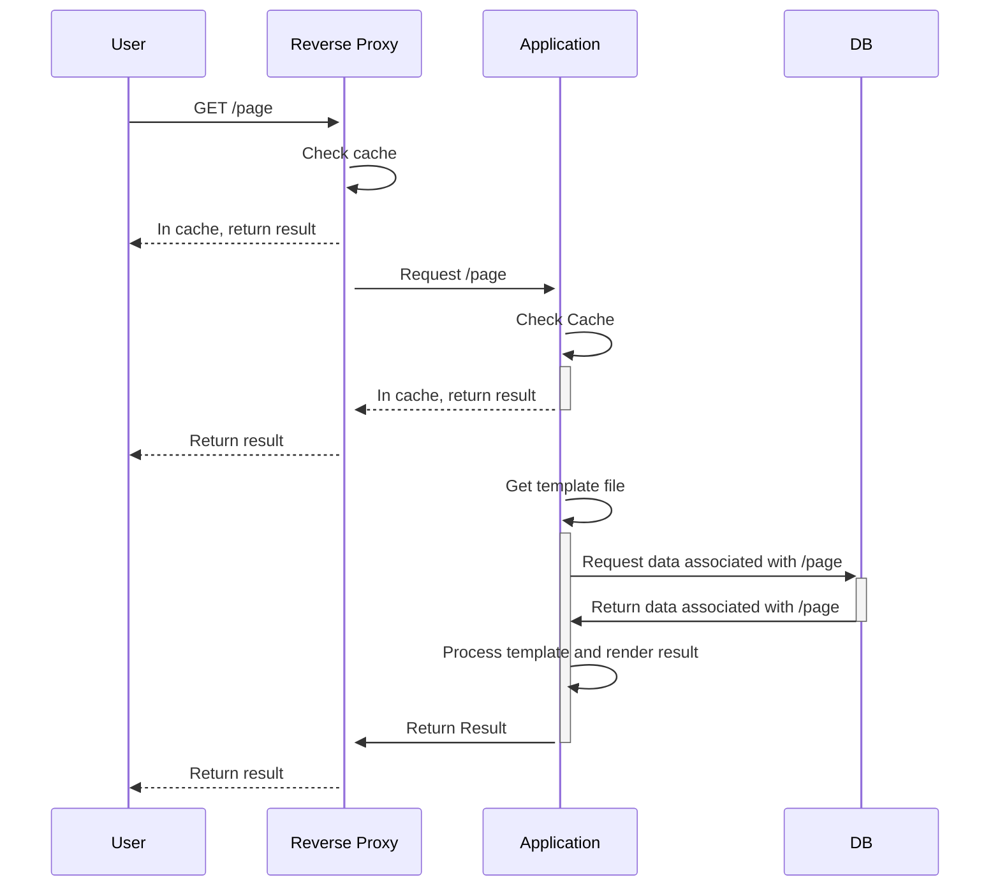

... TODO

```mermaid
sequenceDiagram
    User->>+Reverse Proxy: GET /page
    Reverse Proxy->>+Reverse Proxy: Check cache
    Reverse Proxy-->>User: In cache, return result
    Reverse Proxy->>+Application: Request /page
    Application ->>+Application: Check Cache
    Application-->>-Reverse Proxy: In cache, return result
    Reverse Proxy-->>User: Return result
    Application->>+Application: Get template file
    Application->>+DB: Request data associated with /page
    DB->>-Application: Return data associated with /page
    Application->>Application: Process template and render result
    Application->>-Reverse Proxy: Return Result
    Reverse Proxy-->>User: Return result
```

